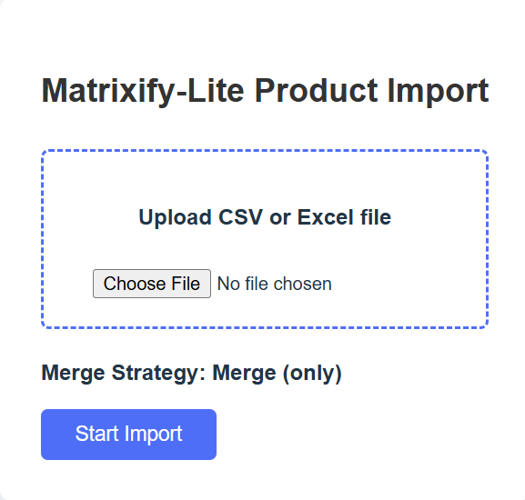
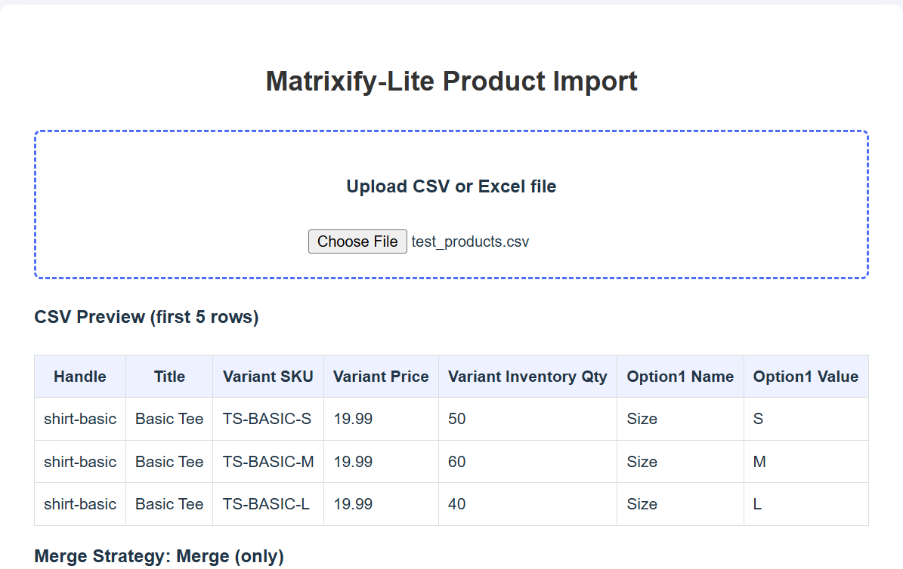
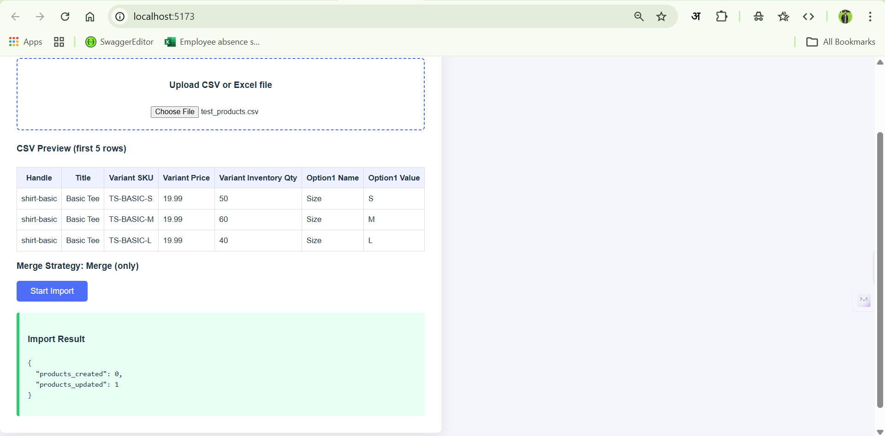
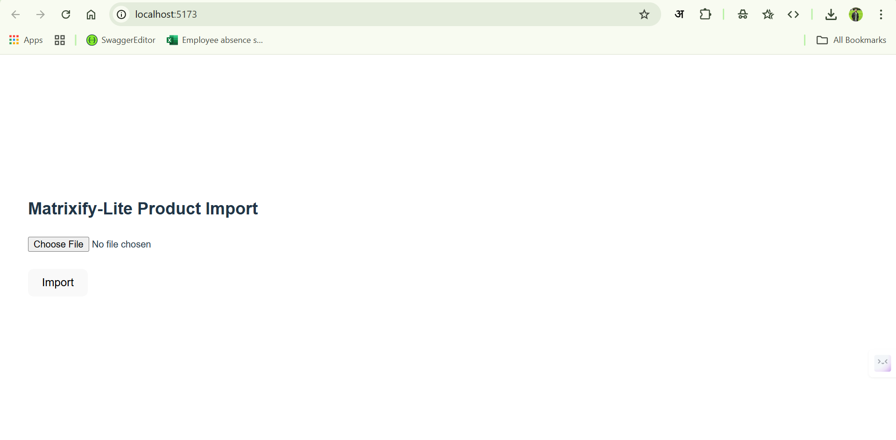
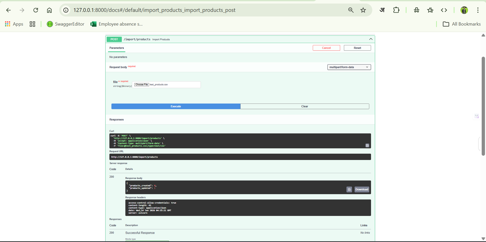

## Matrixify-Lite – Shopify Product Import Tool
# About the Project

Matrixify-Lite is a simple Shopify product import tool built as part of an assignment.

This project runs locally and allows importing products and variants into a Shopify development store using a CSV or Excel file. The main goal of this project is to understand how Shopify product imports work, how merge updates are handled, and how a frontend communicates with a backend API.

The focus of this assignment is functionality and import logic, not database storage.

# Project Flow (How It Works)
User uploads a CSV or Excel file from the frontend
First 5 rows of the file are shown as a preview
User clicks the Import button
Backend processes the uploaded file
Products and variants are created or updated in Shopify
Import result is shown on the UI

## Backend (FastAPI – Python)
# What the backend does
Accepts CSV or Excel file upload
Parses Shopify-style product import files
Groups multiple rows into a single product with multiple variants
Finds existing products using Handle
Finds existing variants using SKU
Applies merge-only update logic
Creates new products or variants if they do not exist
Returns a summary of created and updated records

## Unit Testing
Basic unit tests were added to test the core merge logic used in this assignment.
The tests check:
Creating a product when it does not exist
Updating a product when it already exists
Handling create and update cases safely
Tests are written using `pytest` and focus only on the assignment logic, not Shopify API calls.
To run the tests:
pytest

## Exception Handling & Rollback
Simple exception handling is added in the merge logic to avoid runtime errors when invalid data is received.
For example, checks are added to ensure incoming product or variant data is not null and to safely handle create and update scenarios.

# Rollback is not implemented in this assignment. It may be needed if product creation succeeds but variant creation fails.

# Merge Logic
Only fields present in the CSV are updated
Existing Shopify data is not overwritten if the field is missing in CSV
No products or variants are deleted during import
Database storage is intentionally not used to keep the project simple and focused on core logic.

## Frontend (React + Vite)
# What the frontend does
Provides a file upload interface
Displays preview of the first 5 rows
Shows merge strategy (merge only)
Calls backend import API
Shows loading state during import
Displays success or error response

# CSS and UI
Basic CSS styling is implemented
UI is kept simple and clean
Focus is on usability rather than design complexity

# Supported CSV Fields
Product Level
Handle
Title
Body (HTML)
Vendor
Product Type
Tags

# Variant Level
Variant SKU
Variant Price
Variant Inventory Qty
Option1 Name
Option1 Value
Option2 / Option3 (optional)
Extra or unknown columns are ignored safely.

# Example CSV File
Handle,Title,Variant SKU,Variant Price,Variant Inventory Qty,Option1 Name,Option1 Value
shirt-basic,Basic Tee,TS-BASIC-S,19.99,50,Size,S
shirt-basic,Basic Tee,TS-BASIC-M,19.99,60,Size,M
shirt-basic,Basic Tee,TS-BASIC-L,19.99,40,Size,L

This will create or update one product with three variants.

# How to Run the Project
Backend Setup
cd backend
pip install -r requirements.txt
python -m uvicorn app.main:app --reload

# Backend runs at:
http://127.0.0.1:8000

# Swagger API docs:
http://127.0.0.1:8000/docs

# Frontend Setup
cd frontend
npm install
npm run dev

# Frontend runs at:
http://localhost:5173

# Assumptions & Notes
Shopify development store is used.
Shopify API credentials are configured locally.
Only merge-only strategy is supported.
Inventory quantity is passed in the import file.
Shopify handles inventory by location, so the stock may show as 0.
Database and background jobs are not implemented.
Main focus is on import logic, validation, and API integration.

# Summary
This project demonstrates basic understanding of Shopify product imports, merge update logic, and frontend-backend communication. The assignment focuses on correctness, simplicity, and clean flow rather than advanced features.

## Workflow Screenshots

### File Upload

### CSV Preview

### Import Result

## UI Screen 

### API Documentation

# Future Improvements
Database can be added later to store import results
More import options can be supported in the future